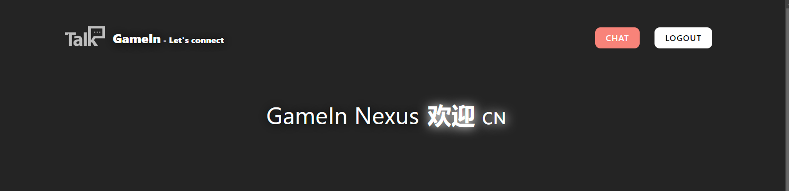
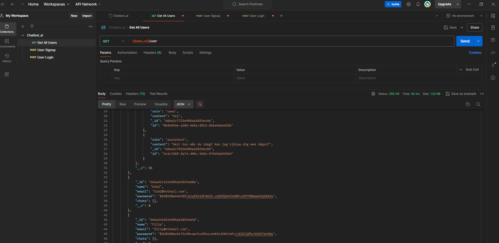

# GameIn Nexus Chatbot AI - OpenAI - Full Documentation

<p align="center">
  
</p>

## Table of Contents

- [Introduction](#introduction)
- [Features](#features)
- [Tech Stack](#tech-stack)
- [Libraries](#Supporting-Libraries-and-Packages)
- [Installation](#installation)
- [Usage](#usage)
- [Configuration](#configuration)
- [Testing](#testing)
- [API Documentation](#api-documentation)
- [Contact](#contact)

## Introduction

GameIn Nexus Chatbot AI is an advanced chatbot solution designed to provide seamless interactions with users. This project leverages cutting-edge AI technology to deliver an intuitive and responsive chat experience.

## Features

- **Natural Language Processing**: Understands and processes user inputs naturally.
- **Scalable**: Easily handles a growing number of users and interactions.
- **Customizable**: Tailor the chatbot responses and behavior to fit your needs.
- **Integration**: Easy integration with various platforms and services.
- **Analytics**: Gain insights into user interactions and chatbot performance.

## Tech Stack

This project is built using the MERN stack:

- **MongoDB**: Database
- **Express.js**: Backend framework
- **React**: Frontend library
- **Node.js**: Runtime environment

## Supporting Libraries and Packages

```json
/*BACKEND*/ "dependencies": {
    "bcrypt": "^5.1.0",
    "concurrently": "^8.2.0",
    "cookie-parser": "^1.4.6",
    "cors": "^2.8.5",
    "dotenv": "^16.3.1",
    "express": "^4.18.2",
    "express-validator": "^7.0.1",
    "jsonwebtoken": "^9.0.1",
    "mongoose": "^7.4.2",
    "morgan": "^1.10.0",
    "openai": "^3.3.0"
  },
```

```json
/*FRONTEND*/"dependencies": {
    "@emotion/react": "^11.13.0",
    "@emotion/styled": "^11.13.0",
    "@mui/material": "^5.16.6",
    "axios": "^1.7.3",
    "grapheme-splitter": "^1.0.4",
    "react": "^18.3.1",
    "react-dom": "^18.3.1",
    "react-hot-toast": "^2.4.1",
    "react-icons": "^5.2.1",
    "react-router-dom": "^6.26.0",
    "react-syntax-highlighter": "^15.5.0",
    "react-type-animation": "^3.2.0"
  },
```

## Installation

1. Clone the repository:
   ```bash
   git clone https://github.com/your-username/saas-chatbot-ai.git
   cd saas-chatbot-ai
   ```
2. Install dependencies:
   ```bash
   npm install
   ```
3. Set up environment variables:
   ```bash
   cp .env.example .env
   ```
4. Run the development server:
   ```bash
   npm start
   ```

## Usage

1. **Starting the backend**:
   ```bash
   npm run dev
   ```
2. **Starting the frontend**:
   ```bash
   npm run dev
   ```
3. **Signup a new user**
4. **Accessing the chat**: Go to the url `http://localhost:3000/chat`.

## Configuration

Configure was by modifying the `.env` file and other configuration files in the `config` directory. Key configuration options include:

- **API keys** for third-party integrations
- **Database settings**
- **Custom response templates**

## Testing

All testing was carried out in Testing.md.

This project has provided valuable experience with API testing using Postman. Through this process, I have learned how to effectively structure and test API requests, ensuring proper functionality and reliability of the application.

Testing was carried out using the Postman application, which allowed for comprehensive API interaction and debugging.

<p align="center">
  
</p>

## API Documentation

The API documentation is available at [API Docs](http://localhost:3000/api-docs) after starting the development server. It includes detailed information on all available endpoints and how to use them.

## Contact

For questions, suggestions, or issues, please send me PM.

---
