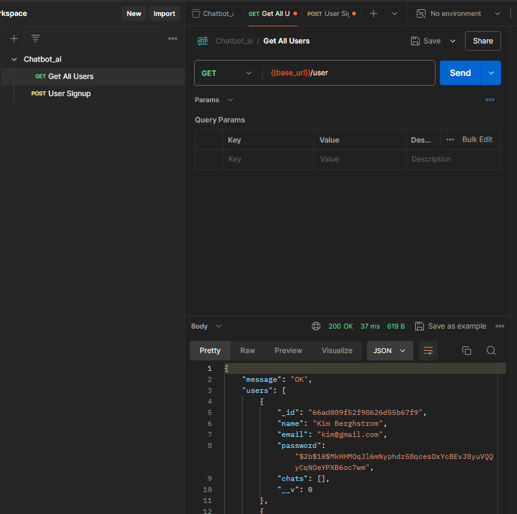

# SaaS Chatbot AI - Full Documentation

## Table of Contents

- [Introduction](#introduction)
- [Features](#features)
- [Tech Stack](#tech-stack)
- [Installation](#installation)
- [Usage](#usage)
- [Configuration](#configuration)
- [Testing](#testing)
- [API Documentation](#api-documentation)
- [Contact](#contact)

## Introduction

SaaS Chatbot AI is an advanced chatbot solution designed to provide seamless interactions with users. This project leverages cutting-edge AI technology to deliver an intuitive and responsive chat experience.

## Features

- **Natural Language Processing**: Understands and processes user inputs naturally.
- **Scalable**: Easily handles a growing number of users and interactions.
- **Customizable**: Tailor the chatbot responses and behavior to fit your needs.
- **Integration**: Easy integration with various platforms and services.
- **Analytics**: Gain insights into user interactions and chatbot performance.

## Tech Stack

This project is built using the MERN stack:

- **MongoDB**: Database
- **Express.js**: Backend framework
- **React**: Frontend library
- **Node.js**: Runtime environment

## Installation

1. Clone the repository:
   ```bash
   git clone https://github.com/your-username/saas-chatbot-ai.git
   cd saas-chatbot-ai
   ```
2. Install dependencies:
   ```bash
   npm install
   ```
3. Set up environment variables:
   ```bash
   cp .env.example .env
   ```
4. Run the development server:
   ```bash
   npm start
   ```

## Usage

1. **Starting the chatbot**:
   ```bash
   npm run start
   ```
2. **Accessing the chatbot**: Open your browser and go to `http://localhost:3000`.

## Configuration

Configure the chatbot by modifying the `.env` file and other configuration files in the `config` directory. Key configuration options include:

- **API keys** for third-party integrations
- **Database settings**
- **Custom response templates**

## Testing

Testing under development was used with POSTMAN application.

<p align="center">
  
</p>

## API Documentation

The API documentation is available at [API Docs](http://localhost:3000/api-docs) after starting the development server. It includes detailed information on all available endpoints and how to use them.

## Contact

For questions, suggestions, or issues, please send me PM.

---
